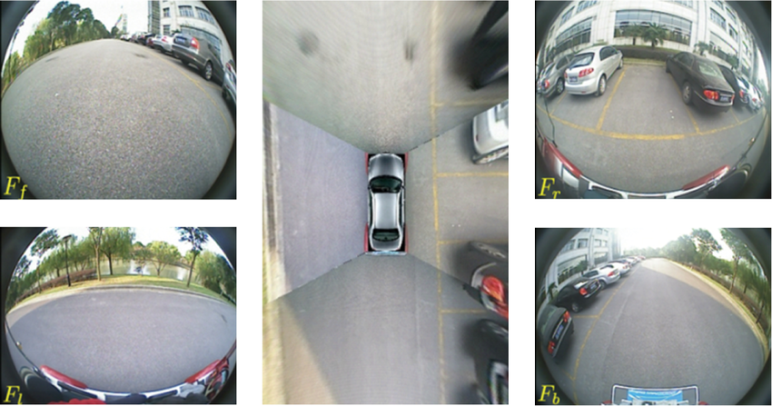

# MultiCamera2BEV
A classicial computer vision based approach to transform images from multi-camera sensors to a single bird's-eye view (BEV) image. It provides a simple implementation for performing bird's-eye view (BEV) transformation using homography. It involves selecting points manually on the images, computing homographies, and transforming the images to a bird's-eye view perspective.

> The code implementation is in progress.


*Source: [Automatic Parking based on a Bird's Eye View System](https://www.researchgate.net/figure/Birds-eye-view-vision-system-Images-F-f-F-l-F-r-F-b-are-captured-from-the-front_fig4_273596538)*

## Steps
1. Load and resize images.
2. Manually select points on images for the BEV transformation.
3. Compute homographies using selected points.
4. Warp images to the bird's-eye view perspective.
5. Stitch the warped images together to create a final BEV image.

## Install
Follow these steps to get your project set up.
```
git clone https://github.com/shashankag14/MultiCamera2BEV.git
cd MultiCamera2BEV
conda env create -f environment.yml
conda activate bev
```

## Usage
Run the following command form the root directory:
```
python main.py
```

## Notes
- The final shape of the BEV output matters how the input images are warped and how much overlap they share with each other. Fine-tuning the final output shape always helps.
- Make sure that you have enough features in each warped image after applying the homography. These features are used for feature matching and image stitching at the end.

## Analysis: Feature Detection and Matching (ORB v/s SIFT)
**1. ORB (Oriented FAST & Rotated BRIEF)**
- Uses *FAST (Features from Accelerated Segment Test)* for keypoint detection.
- Uses *BRIEF (Binary Robust Independent Elementary Features)* for feature description.
- Improves BRIEF by adding *rotation invariance*.
- Uses *Hamming Distance* for feature matching, making it very fast.

**2. SIFT (Scale-Invariant Feature Transform)**
- Finds *keypoints at multiple scales** using the *Difference of Gaussians (DoG)*.
- Computes a *128-dimensional descriptor* for each keypoint.
- Uses *Euclidean Distance* for feature matching.
- More accurate but computationally heavy.

| Use Case                                      | ORB | SIFT |
|----------------------------------------------|-----|-----|
| Real-time applications (fast in computation) | ✅ | ❌ |
| Low computational power (suitable for edge devices) | ✅ | ❌ |
| High accuracy (for image stitching) | ❌ | ✅ |
| Works well in varying lighting conditions (eg. low light, shadows) | ❌ | ✅ |
| Works well in case of less features (eg. walls, sky, smooth surfaces) | ❌ | ✅ |

## Analysis: Image Stitching Mode for OpenCV
When stitching images for a bird's eye view, selecting the right stitching mode is important. In this project, I used OpenCV's `cv2.createStitcher()` to stitch the warped images. OpenCV provides two different modes for this - `cv2.Stitcher_SCANS` and `cv2.Stitcher_PANORAMA`.
| `cv2.Stitcher_SCANS` | `cv2.Stitcher_PANORAMA` |
|-----|-----|
| Designed for stitching *scanned* like surfaces (eg. documents, maps, BEVs)  | Designed for stitching wide-angle views |
| Works well when images are captured **for a single view point** and covers a flat (or planar) surface. | Works well when images are captured **from a single view point** but different angles |
| Works best when there’s no depth variation between images. | Doesn't handle parallax very well and may lead to some distortions. |

Since our goal is to generate a vird's eye view image based on multiple camera images, **we use `cv2.Stitcher_SCANS` mode**. Each camera points directly downwards and aligned in a way that the field of view overlaps appropriately to cover an entire area. 

## Analysis: Warped Image Enhancement
If the warped images generated after applying the homography lacks sufficient features for matching (using ORB or SIFT), follow the steps below to enhance the image and improve feature detection:

- Visualize Detected Keypoints:Display the detected keypoints on the warped image to check the number and quality of features. Check how many keypoints have good matches across the warped images. If there are few or poor matches between the images, it indicates insufficient features for reliable matching.
- Enhance the Image Features:
    - increase the image contrast 
    - apply sharpening techniques to highlight edges
    - apply histogram equalization to mprove the distribution of pixel intensities (also known as contrast stretching)
- Recheck Feature Detection: After enhancing the warped images, rerun the feature detection and matching process to see if the number of good matches improves.

## ToDo:
&#9745; Investigate on enhacing the warped images (if there aren't enough features available for feature matching) \
&#9744; Choose the best shape for BEV output. It affects the warped images generated after applying the homography \
&#9744; Use a logger for the repository \
&#9744; Improve error handling \
&#9744; Refactor main.py